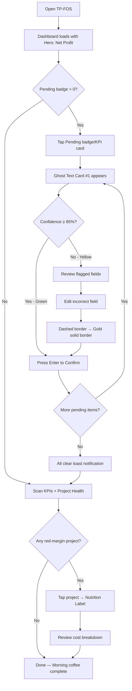
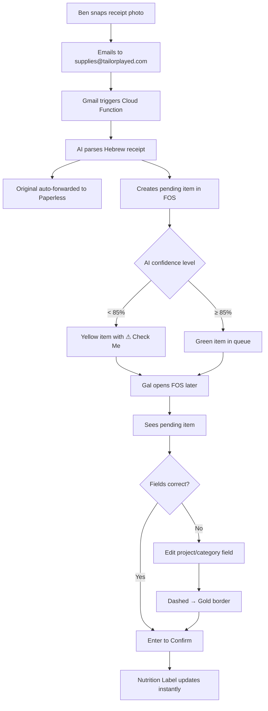
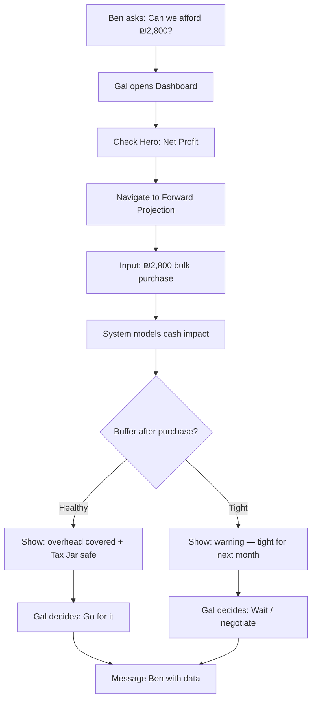
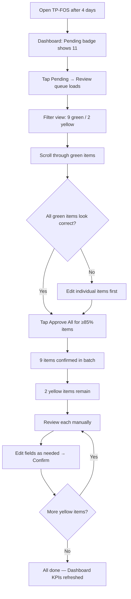
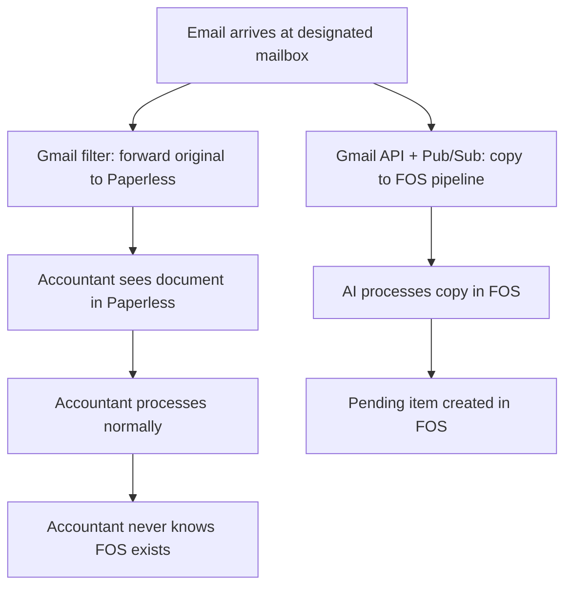

# UX Design Specification TP-FOS

**Author:** Galelbaz
**Date:** 2026-02-06

---

<!-- UX design content will be appended sequentially through collaborative workflow steps -->

## Executive Summary

### Project Vision

TP-FOS is a personal financial cockpit — an operational intelligence layer that sits alongside legal accounting tools (Summit for receipts, Paperless for tax compliance) to provide what they cannot: real-time unit economics per project, full overhead visibility, and AI-powered financial document ingestion.

The system employs a Parallel Fork Pattern — financial documents split at the email level. Originals flow untouched to the accountant via Paperless. Copies go to TP-FOS for AI processing via Gemini. FOS is never a gatekeeper; if FOS is down, the accountant still gets documents.

Four interlocking modules create a "Nutrition Label" for every game project: the Dashboard (cockpit KPIs), Work Orders (project cost containers), AI Ingestion + Ghost Text Review (< 30 second invoice processing), and Inventory + WAC + Scoop (shared material consumption with Weighted Average Cost tracking).

The product is bilingual (Hebrew RTL + English LTR), multi-currency (ILS base, USD/EUR with conversion flagging), and designed for full mobile parity. An existing TailorPlayed Design System — deep purple/gold "Premium Elegance" theme with Fredoka font — provides the visual foundation.

### Target Users

**Gal (Financial Operator — Primary):** Daily power user. Reviews AI-classified invoices via Ghost Text, manages Work Orders and Nutrition Labels, tracks project margins, makes spending decisions. Intermediate technical skill. Uses both desktop and mobile. Core interaction cadence: the 5-minute "Morning Coffee Review."

**Ben (Business Owner — Decision Consumer):** Consumes the dashboard for quick financial answers. Needs to assess "can I buy this?" in under 60 seconds by glancing at margins, overhead, and Tax Jar. Does not do data entry. Shares the same UI as Gal but at a shallower interaction depth.

**The Accountant (Passive/Indirect):** Never logs into FOS. Receives auto-forwarded original documents via Gmail filter routing to Paperless. Zero UI requirements.

### Key Design Challenges

1. **Ghost Text in a Bilingual World:** The AI review UI must handle Hebrew RTL vendor names alongside English LTR amounts, mixed-language invoice descriptions, and currency symbols — all within a "confirm with Enter" flow that feels instant and visually coherent.

2. **Data Density vs. Brand Warmth:** The TailorPlayed design system emphasizes rounded corners, gold glows, and generous spacing ("premium board game lounge"). A financial dashboard demands dense tables, compact KPI cards, and scannable numbers. Balancing the playful brand with "pilot's cockpit" density is the central design tension.

3. **Two Users, One Dashboard:** Gal needs deep drill-down capability (Nutrition Labels, Ghost Text editing, Scoop flows). Ben needs 30-second glance-ability (margins, health indicators, yes/no on spending). The UI must serve both interaction depths without feeling cluttered or shallow.

4. **The Scoop Micro-Interaction:** Consuming inventory into a Work Order (search material, input quantity, see WAC cost added to COGS) must be fast enough to not break flow, yet precise enough that the math is trusted. This is a frequent, high-precision micro-interaction.

5. **Forward Projection Visualization:** Answering "can we afford this ₪2,800 bulk order?" requires visualizing cash flow impact over months, factoring Tax Jar, overhead, and incoming revenue — presented intuitively, not as a spreadsheet.

### Design Opportunities

1. **The Morning Coffee Ritual as UX Architecture:** Every screen and flow should optimize for the question: "Can this be done in under 5 minutes as part of a daily ritual?" This provides a design north star that most financial tools lack — time-bounded, ritual-oriented design.

2. **Ghost Text as Signature Interaction:** AI suggestions appear in muted state ($text-muted, gold at 50%). Upon confirmation they "solidify" to full $gold with a fadeIn transition. The visual shift from "suggestion" to "fact" becomes a satisfying micro-moment that builds trust in the AI over time.

3. **Color-Coded Health as Emotional Design:** Green/yellow/red margin indicators combined with the warm gold palette create an emotional dashboard where you *feel* the health of the business at a glance — before reading a single number. Semantic colors on deep purple backgrounds leverage the design system's 11.2:1 contrast ratio.

## Core User Experience

### Defining Experience

The **Ghost Text Review** is TP-FOS's defining interaction — the moment where raw financial chaos (an invoice email) becomes structured financial truth (a classified, project-linked transaction). Every other feature is either upstream (AI processing, email ingestion) or downstream (dashboards, Nutrition Labels, projections) of this core act.

The interaction follows the "Correct What's Wrong" paradigm: AI pre-fills every field — vendor, amount, currency, category, project linkage. The user's job is not to *enter* data, but to *verify* it. Confirming a correct suggestion takes a single keystroke (Enter). Correcting takes a targeted edit. This inversion — from "fill blank forms" to "confirm pre-filled intelligence" — is what makes TP-FOS fundamentally different from manual accounting tools.

The core loop: **Arrive → Scan → Confirm → See Impact → Leave.** The "See Impact" moment is critical — when a confirmed transaction instantly updates the Nutrition Label, KPIs, and Tax Jar in real-time, the user *feels* the system working. The feedback loop is what builds trust.

### Platform Strategy

**Desktop-First, Mobile-Complete:**

| Platform | Role | Primary Input | Key Context |
|---|---|---|---|
| **Desktop (1024px+)** | Primary daily driver | Keyboard + mouse | Morning Coffee Review at desk. Sidebar navigation, KPI cards, Project Health Table, and Review Sidebar visible simultaneously. Enter-to-confirm optimized for keyboard. |
| **Tablet (768–1023px)** | Secondary | Touch + keyboard | Collapsible sidebar, stacked KPIs, scrollable table. Full functionality, adapted layout. |
| **Mobile (375–767px)** | On-the-go capability | Touch | Bottom navigation, single-column, swipe-able KPI cards, full-screen Ghost Text review. Tap-to-confirm replaces Enter. All actions available. |

**Interaction Model:**
- Desktop: Keyboard-first. Tab through pending items, Enter to confirm, E to edit, Delete to reject. Power-user speed.
- Mobile: Touch-first. Swipe cards, tap to confirm, pull-down to refresh. Same data, adapted gestures.

**No offline requirement.** Real-time Firestore data is the product's value — stale data defeats the purpose.

### Effortless Interactions

**Zero-Friction (should feel invisible):**

1. **Invoice confirmation** — One keystroke (Enter) when AI is correct. Target: < 5 seconds per high-confidence item.
2. **Batch approval** — "Approve All" for items with confidence ≥ 85%. 10 green items cleared in one action.
3. **Dashboard scan** — Open the page, answers are already visible. No clicks needed to understand business health.
4. **Accountant forwarding** — Completely invisible. Happens at the Gmail level. User never thinks about it.

**Low-Friction (should feel fast):**

5. **Ghost Text editing** — Tab to a field, type correction, Enter to confirm. No dropdowns unless choosing from a project list.
6. **Scoop action** — Search material → input quantity → see cost → confirm. Under 10 seconds for a practiced user.
7. **Language switching** — Toggle between Hebrew and English without page reload. Layout flips RTL/LTR instantly.

**Worth-the-Friction (complexity earned by value):**

8. **Work Order creation** — Manual form entry. Worth the effort because it's infrequent (a few per month) and creates the container everything else flows into.
9. **Forward projection** — Modeling a spending decision. Worth the analysis because it answers a high-stakes question.

### Critical Success Moments

1. **The First Ghost Text Confirmation** — The user sees an AI-classified invoice, realizes every field is correct, presses Enter, and watches the Nutrition Label update. This is the "aha" that proves the system works. If this fails, nothing else matters.

2. **The Red Margin Discovery** — The moment the Project Health Table reveals a project below 20% margin that the user *thought* was profitable. This is FOS's promise delivered: visibility you couldn't have without it.

3. **The "Can I Afford This?" Answer** — Ben asks about a purchase. Gal opens the dashboard, checks overhead, Tax Jar, and projection in under 60 seconds, and gives a data-backed answer. The moment mental math dies.

4. **The Batch Approval Morning** — After a convention or busy week, 11 pending items. 9 green. "Approve All." Done in 10 seconds. The system handled everything while you were away.

5. **The First-Time Setup Payoff** — First Work Order created manually. First costs entered. The Nutrition Label calculates a real margin. The user sees their business through a new lens for the first time.

### Experience Principles

1. **Ritual Over Workflow** — Design for a 5-minute daily cadence, not an hour-long accounting session. Every screen asks: "Can this be part of the Morning Coffee?"

2. **Confirm, Don't Create** — The default user action is verification, not data entry. AI does the work; humans do the judgment.

3. **Impact Visible Instantly** — Every confirmed transaction, every Scoop, every status change immediately reflects in KPIs, Nutrition Labels, and projections. No "refresh" needed. No "processing" delay.

4. **Trust Through Transparency** — Confidence scores, "Estimated" flags on currency conversions, "Check Me" badges — the system earns trust by showing when it's uncertain, not by hiding uncertainty.

5. **Same Family, Different Room** — The dashboard feels like a natural extension of TailorPlayed's brand identity. Warm, premium, playful — adapted for data density but never clinical.

## Desired Emotional Response

### Primary Emotional Goals

**The Core Feeling: "I've got this."**

TP-FOS should make the user feel like a competent operator in full control of their financial reality. Not anxious about money, not bored by accounting — *empowered* by clarity. The emotional goal is the confidence that comes from knowing, not guessing.

| Emotional Goal | What It Feels Like | When It Happens |
|---|---|---|
| **Confidence** | "I know exactly where we stand." | Scanning the dashboard, seeing all KPIs at a glance |
| **Control** | "Nothing slips through the cracks." | Every invoice captured, classified, and accounted for |
| **Relief** | "That took 3 minutes, not 30." | Completing the Morning Coffee Review and closing the tab |
| **Clarity** | "Now I can decide." | Answering "can I afford this?" with data instead of gut feel |
| **Trust** | "The system is right — and tells me when it's not sure." | Seeing confidence scores, "Check Me" badges, "Estimated" flags |

### Emotional Journey Mapping

**First Visit — "This sees what I couldn't see"**
The first Nutrition Label reveals a real margin number the user has never calculated before. The feeling: a mix of surprise ("I didn't know it was that") and empowerment ("now I can act on it"). Design implication: the first Work Order setup should *reward immediately* — show the margin calculation the instant costs are entered, don't hide it behind a "save" button.

**Daily Ritual — "I've got this"**
Morning Coffee Review. 2-3 pending items, confirm with Enter, scan the dashboard, done. The feeling: competence and ease. Like checking the weather before heading out — quick, reliable, no friction. Design implication: the dashboard must load fast, show everything above the fold, and pending items should be visible without navigating away.

**The Red Alert — "Good thing I caught that"**
A project margin drops below 20%, or the Osek Patur threshold approaches 80%. The feeling is not *panic* — it's *gratitude for early warning*. The system caught it before it became a problem. Design implication: alerts should feel informative, not alarming. Use warm amber/yellow before escalating to red. Frame as "heads up" not "danger."

**After a Busy Week — "It handled everything while I was gone"**
11 pending items, 9 green. Approve All. Done in seconds. The feeling: the system is a reliable partner, not a demanding boss. Design implication: batch approval should feel *satisfying*, not rushed. A brief animation showing all items clearing at once — a visual exhale.

**Error State — "I know what to do"**
AI confidence is low, or a currency conversion is stale, or a vendor is unrecognized. The feeling should never be confusion or helplessness — it should be "I can see exactly what needs my attention and why." Design implication: error and uncertainty states should be *specific* ("Vendor not recognized — assign manually") not vague ("Something went wrong").

### Micro-Emotions

| Micro-Emotion | Where It Matters | Design Response |
|---|---|---|
| **Confidence → not Confusion** | Ghost Text fields, AI suggestions | Clear visual hierarchy: what's AI-suggested (muted) vs. what's confirmed (solid). Never ambiguous. |
| **Trust → not Skepticism** | AI classification accuracy | Confidence scores visible. "Check Me" badge is honest, not hidden. Over time, user learns to trust green items. |
| **Accomplishment → not Frustration** | Completing review, Scoop action | Immediate visual feedback. Nutrition Label updates in real-time. Numbers change before your eyes. |
| **Calm → not Anxiety** | Tax Jar, red margin alerts | Tax Jar framed as "money set aside" (positive framing), not "money owed" (anxiety framing). Red margins are "attention needed" not "you failed." |
| **Pride → not Indifference** | Seeing a well-managed project | Green margins should feel *earned*. The Nutrition Label is proof that good decisions compound. |

### Design Implications

**"I've got this" requires three UX properties:**

1. **Legibility at a Glance** — Every key number (Net Profit, Tax Jar, project margins) must be readable in under 2 seconds without squinting, scrolling, or clicking. Use the design system's `$text-2xl` (40px) for primary KPIs, `$gold` for emphasis, and `$text-secondary` for context labels. The dashboard is a *cockpit* — information must be scannable, not readable.

2. **Feedback Loops, Not Dead Ends** — When a user confirms a Ghost Text item, the impact should be *visible immediately*. The Nutrition Label ticks. The Net Profit adjusts. The Tax Jar recalculates. This isn't just a performance requirement — it's an emotional one. The user needs to *see* that their action mattered.

3. **Graceful Uncertainty** — When the system isn't sure, it shouldn't pretend to be confident or dump the problem on the user. The `$warning` amber (#FA9700) "Check Me" badge says: "I did my best, but I need your judgment here." This is how trust is built — through honest calibration, not false confidence.

### Emotional Design Principles

1. **Empower, Never Alarm** — Financial data can be stressful. TP-FOS reframes data as *tools for decisions*, not *sources of anxiety*. Red margins are "opportunities to act," not "failures." The Tax Jar is "money set aside," not "money owed."

2. **Reward Every Action** — Every confirm, every Scoop, every status update produces visible, immediate feedback. The user should never wonder "did that work?" This is the "I've got this" feeling in micro-form — constant reinforcement that your actions have impact.

3. **Honest Over Polished** — Trust is built by showing uncertainty, not hiding it. Confidence scores, "Estimated" flags, "Check Me" badges — these aren't design flaws, they're trust-building features. An honest AI is more useful than a confident one.

4. **Warm, Not Clinical** — Financial dashboards tend toward cold, sterile design. TP-FOS inherits TailorPlayed's warmth: Fredoka's rounded letterforms, the gold-on-purple palette, subtle hover lifts. The numbers are serious; the experience is human.

5. **Closure at Every Session** — The Morning Coffee Review should end with a feeling of *completeness*. No lingering "I should check one more thing." The dashboard shows pending count = 0, all margins visible, Tax Jar up to date. The user can close the tab and *know* they're done.

## UX Pattern Analysis & Inspiration

### Inspiring Products Analysis

**Blink (Israeli Investment Platform)**

Blink transforms the anxiety-inducing world of personal investing into a calm, confident experience. Key UX successes:

- **Portfolio-at-a-glance:** Big numbers for total value and daily change. Color-coded green/red for gains/losses. Scannable in under 3 seconds — no scrolling needed to understand financial health.
- **Living data:** Real-time price ticks make the dashboard feel alive, not stale. Numbers *move*. This builds trust that the data is current.
- **Card-based hierarchy:** Each holding is a clean card with name, value, and change. Dense information without visual clutter. Cards are tap-to-expand for deeper detail.
- **Non-intimidating financial design:** Rounded corners, clean typography, generous whitespace. Proves that financial tools don't need to look like trading terminals to be taken seriously.
- **Relevance to TP-FOS:** The Dashboard and Project Health Table should adopt Blink's "scannable in 3 seconds" principle. KPI cards should use big, bold numbers with color-coded change indicators. The Nutrition Label should feel as clean as a Blink portfolio card.

**Claude (Anthropic AI Assistant)**

Claude's chat interface is the purest example of the "AI suggests, human confirms" interaction model:

- **Transparent intelligence:** The AI shows its reasoning, not just its answer. When uncertain, it says so. This builds trust faster than false confidence.
- **Minimal friction:** No forms, no dropdowns. The human types corrections naturally. The interaction feels like a conversation, not data entry.
- **Clean output separation:** AI-generated content is clearly distinguishable from user input. The visual hierarchy between "what the system produced" and "what you said" is never ambiguous.
- **Progressive disclosure:** Simple answers appear first; detailed reasoning is available but not forced on the user.
- **Relevance to TP-FOS:** The Ghost Text review should adopt Claude's transparency principle — show confidence scores visibly, not hidden in tooltips. The "AI suggests, human confirms or corrects" flow should feel as natural as refining a Claude response. Muted text for suggestions → solid text for confirmed data mirrors Claude's input/output visual distinction.

**Gett (Ride-Hailing)**

Gett is the gold standard for single-action optimization:

- **One primary action per screen:** Open the app, the CTA is immediately clear. No decision paralysis.
- **Real-time status feedback:** After ordering, you see the driver's location, ETA, and status in real-time. You never wonder "did it work?"
- **Speed to completion:** The core flow (open → order → confirm) takes under 10 seconds for a returning user.
- **Visual progress tracking:** Status moves through clear stages. The user always knows where they are in the flow.
- **Relevance to TP-FOS:** The Morning Coffee Review should feel as fast as ordering a Gett. Open → see pending items → confirm → done. Work Order status progression (Lead → Design → Production → Shipped) should be as visually clear as Gett's ride status tracking.

**Bit (Bank Leumi Payments)**

Bit proves that financial transactions can be simple, trustworthy, and beautifully Hebrew:

- **Instant confirmation feedback:** Send money, see the confirmation immediately. Balance updates in real-time. No "pending" ambiguity.
- **Hebrew-native design:** Full RTL that feels natural, not like a mirrored English UI. Currency formatting (₪), date formatting (DD/MM/YYYY), and number conventions all feel native.
- **Scannable transaction history:** Recent transactions are clean, chronological, with vendor/recipient, amount, and date. No noise.
- **Trust through simplicity:** Every step of a transaction is explicit. Confirm screens show exactly what will happen before you commit.
- **Relevance to TP-FOS:** The Hebrew/RTL experience should feel as native as Bit's — not a translated English UI. Transaction review confirmation should adopt Bit's "show exactly what will happen" principle. The audit log and transaction history should be as scannable as Bit's payment history.

### Transferable UX Patterns

**Navigation & Layout Patterns:**

| Pattern | Source | Application in TP-FOS |
|---|---|---|
| **Portfolio-at-a-glance** | Blink | Dashboard KPI cards: big numbers, color-coded changes, zero-scroll overview |
| **Single primary action per context** | Gett | Each screen has one obvious CTA. Dashboard = "Review pending items." Work Order = "Add cost." Inventory = "Scoop." |
| **Sidebar + main content** | Claude | Desktop layout: persistent sidebar nav + main content area + Review Sidebar overlay |

**Interaction Patterns:**

| Pattern | Source | Application in TP-FOS |
|---|---|---|
| **AI suggests, human confirms** | Claude | Ghost Text review: AI pre-fills fields in muted state, user confirms with Enter or corrects inline |
| **Real-time feedback loop** | Blink, Bit | Nutrition Label updates instantly when costs change. KPIs tick after transaction confirmation. |
| **Speed-to-completion flow** | Gett | Morning Coffee Review optimized for < 5 minutes. Each pending item confirmable in < 5 seconds. |
| **Explicit confirmation** | Bit | Before batch approval, show exactly how many items and total amount. No silent bulk actions. |

**Visual & Emotional Patterns:**

| Pattern | Source | Application in TP-FOS |
|---|---|---|
| **Color-coded financial states** | Blink | Green (healthy margin), yellow (watch), red (< 20% margin). Same semantic colors the user already understands from investing. |
| **Living data feel** | Blink | Numbers that update in real-time after actions, not on page refresh. The dashboard feels alive. |
| **Native Hebrew/RTL** | Bit | RTL that feels designed-for, not adapted. CSS logical properties, Hebrew-first content, Israeli conventions. |
| **Non-intimidating density** | Blink | Financial data in clean cards with generous radius and warm colors — dense but not overwhelming. |

### Anti-Patterns to Avoid

1. **The Excel Dashboard** — Financial tools that look like spreadsheets with borders. TP-FOS should feel like Blink (warm, visual, card-based), not like a pivot table. Data density yes, spreadsheet aesthetic no.

2. **The Hidden Confirmation** — Systems where you submit something and aren't sure it worked. Every action in TP-FOS must produce immediate, visible feedback (learned from Gett and Bit). No "your changes have been saved" toast that disappears — show the *impact* of the change.

3. **The Translated UI** — Hebrew interfaces that are clearly mirrored English layouts. Bit proves that Hebrew-first design feels fundamentally different. TP-FOS's Hebrew mode should feel native, with RTL-aware spacing, alignment, and iconography.

4. **The Overloaded Dashboard** — Trying to show everything on one screen. Blink shows the portfolio summary first, details on tap. TP-FOS's dashboard should show KPIs and Project Health Table above the fold; Work Order details, inventory, and projections are drill-down views.

5. **The Black Box AI** — Systems where AI makes decisions without showing its reasoning. Claude's transparency is the model: TP-FOS shows confidence scores, explains classification reasoning, and flags uncertainty visibly.

### Design Inspiration Strategy

**Adopt Directly:**
- Blink's card-based KPI layout for the Dashboard
- Claude's "AI suggests, human confirms" visual pattern for Ghost Text
- Bit's Hebrew-native RTL design approach and confirmation flows
- Gett's single-primary-action-per-screen principle

**Adapt for TP-FOS:**
- Blink's real-time ticking numbers → adapted for margin calculations (update on confirm, not continuous tick)
- Claude's conversation flow → adapted into structured Ghost Text fields (not free-text, but pre-filled form fields)
- Gett's status tracking → adapted for Work Order status progression with visual stage indicators

**Avoid Deliberately:**
- Spreadsheet-style financial layouts (conflicts with "warm, not clinical" principle)
- Hidden or delayed confirmation feedback (conflicts with "reward every action" principle)
- Mirrored-English Hebrew layouts (conflicts with native bilingual experience)
- AI decisions without visible reasoning (conflicts with "trust through transparency" principle)

## Design System Foundation

### Design System Choice

**Custom TailorPlayed Design System — SCSS Modules Implementation**

TP-FOS uses an existing, fully specified custom design system extracted from the TailorPlayed v3 website. This is not a third-party component library — it is a purpose-built design language documented in two reference files:

- `design-system.md` — Complete specification: tokens, component anatomy, mixins, accessibility rules, dashboard-specific adaptations
- `design-system-template.html` — Live HTML/CSS reference implementation with all components rendered

The design system will be implemented using **SCSS Modules** with CSS Custom Properties, maintaining 1:1 fidelity to the source specification.

### Rationale for Selection

| Factor | Decision | Rationale |
|---|---|---|
| **Design System Type** | Custom (existing) | TailorPlayed already has a comprehensive, documented design system. No third-party system needed. |
| **CSS Architecture** | SCSS Modules | The design system is authored in SCSS with variables, mixins, and component patterns. SCSS Modules preserve this fidelity exactly — no translation layer needed. |
| **Why not Tailwind** | Fidelity over speed | Tailwind would require re-mapping every SCSS token into Tailwind config utilities. The translation introduces interpretation gaps and loses the mixin patterns ($card-surface, $elevated-surface, $focus-ring). |
| **Why not CSS Modules only** | Mixins matter | Plain CSS Modules can't express `@include card-surface` or `@include focus-ring`. SCSS mixins are core to the design system's component recipes. |
| **Why not a component library (MUI, Chakra)** | Brand integrity | Third-party libraries impose their own design opinions. The TailorPlayed aesthetic — deep purples, gold accents, Fredoka font, rounded warmth — is unique and fully specified. Theming a library to match is more work than building from the spec. |

### Implementation Approach

**Architecture:**

```
src/
  styles/
    _variables.scss       # All design tokens (colors, typography, spacing, radius, shadows, transitions)
    _mixins.scss          # Component mixins (card-surface, elevated-surface, focus-ring, interactive-reset, etc.)
    _animations.scss      # Keyframes (fadeIn, slideUp, scaleIn, pulse, shimmer, spin)
    _accessibility.scss   # Focus rings, reduced motion, high contrast, RTL support
    global.scss           # Base reset, typography rules, scrollbar styling, selection colors
  components/
    Button/
      Button.module.scss  # Component-scoped styles using design system tokens
      Button.tsx
    KpiCard/
      KpiCard.module.scss
      KpiCard.tsx
    ...
```

**Token Flow:**

1. SCSS variables (`$bg-tertiary`, `$gold`, `$radius-lg`) defined in `_variables.scss`
2. CSS Custom Properties (`--color-bg-tertiary`, `--color-gold`, `--radius-lg`) generated from SCSS for runtime theming and i18n switching
3. SCSS Modules import variables and mixins directly — component styles reference the same tokens as the spec
4. RTL/LTR switching via CSS Custom Properties and the `@include rtl { }` mixin

**Component Strategy:**

| Component Type | Build Approach | Source Reference |
|---|---|---|
| **Buttons** (Primary, Secondary, Ghost, Icon) | Build from spec | Design system Section 3.1 — 3 variants, 3 sizes, all states |
| **Cards** (Dashboard, Note, Elevated) | Build from spec | Design system Section 3.2 — card-surface, ContactInfoCard, NoteCard patterns |
| **Data Tables** (Standard, Dense) | Build from spec | Design system Section 3.3 — sticky headers, sortable, clickable rows, dense variant |
| **Form Inputs** (Input, Select, Textarea, Search) | Build from spec | Design system Section 3.4 — all states, FormField molecule |
| **Badges** (Generic, Status) | Build from spec | Design system Section 3.5 — semantic color at 15-20% opacity |
| **Tooltips** | Build from spec | Design system Section 3.6 — elevated background, gold border |
| **KPI Cards** | Build from recipe | Design system Section 7.1 — dashboard-specific extrapolation |
| **Sidebar Nav** | Build from recipe | Design system Section 7.3 — hover/active states |
| **Filter Chips** | Build from recipe | Design system Section 7.4 — compact selectable chips |
| **Ghost Text Review** | Custom build | New component — informed by design system tokens + Claude/Bit inspiration patterns |
| **Nutrition Label** | Custom build | New component — Blink card-based financial display pattern using design system tokens |
| **Scoop Modal** | Custom build | New component — search + quantity input using design system form patterns |

### Customization Strategy

**Dashboard Density Adaptations (from design system spec):**

The design system explicitly documents how to adapt the website's visual language for dashboard density:

| Website Default | Dashboard Adaptation | Token Change |
|---|---|---|
| Body text 18px (`$text-base`) | Table body 16px (`$text-sm`) | Use `$text-sm` for data tables |
| Card padding 24px (`$space-lg`) | Card padding 16px (`$space-md`) | Use `$space-md` for dashboard cards |
| Rounded corners 16px (`$radius-lg`) | Cards 12px (`$radius-md`), inputs 8px (`$radius-sm`) | Tighter radius for dense views |
| Gold glow on all hovers | Glow reserved for primary CTAs only | `$shadow-glow` only on `.btn-primary:hover` |
| slideUp/scaleIn animations | fadeIn only for panel loads | Skip decorative animations for data rows |

**New Components (not in original design system):**

Components specific to TP-FOS that don't exist in the TailorPlayed website will be built using the design system's existing tokens and patterns as their foundation:

- **Ghost Text fields** — Built on Input atom (Section 3.4), with `$text-muted` for AI-suggested state and `$text-primary` for confirmed state
- **Confidence badges** — Built on Badge pattern (Section 3.5), using `$success` for ≥ 85% and `$warning` for < 85%
- **Nutrition Label card** — Built on ContactInfoCard pattern (Section 3.2), with `$success`/`$warning`/`$error` for margin indicators
- **Work Order status stepper** — Built on StatusBadge pattern (Section 3.5), mapping Lead/Design/Production/Shipped to status colors
- **Pending Review sidebar** — Built on sidebar pattern with NoteCard items (Sections 7.3 + 3.2)

**Critical Design Rules (enforced from spec):**

- No white (#fff) text on dark backgrounds — all text uses the gold scale
- 44px minimum touch targets on ALL interactive elements
- 2px solid $gold focus rings with 2px offset on all focusable elements
- CSS logical properties for RTL support (padding-inline-start, margin-inline-end)
- `prefers-reduced-motion: reduce` disables all Tier 2/3 animations
- Fredoka is the sole typeface — no secondary fonts except monospace for IDs/codes

## Defining Experience

### The Defining Interaction

**"See what the AI found. Press Enter. Watch the numbers update."**

TP-FOS's defining experience is the **Ghost Text Review** — a focused confirmation card that transforms AI-classified financial documents into trusted, project-linked transactions. This is the moment where the product proves its value: an invoice that would have taken 2-3 minutes of manual data entry is reviewed and confirmed in under 15 seconds.

The interaction pattern combines three proven references:
- **Bit's confirmation screen** — Full focus, explicit "here's what will happen," confirm with intent
- **Claude's AI transparency** — Show the reasoning, flag uncertainty, let the human be the judge
- **Gett's speed-to-completion** — Start to finish in seconds, never wonder "did it work?"

### User Mental Model

**What users expect:**
The user's mental model is *email triage*. They already understand "scan, decide, act" from processing their inbox every morning. Ghost Text extends this: "scan what the AI found, verify it's correct, confirm." The key insight: users don't expect to *create* data — they expect to *approve* intelligence.

**Current pain (the "before"):**
Today, an invoice arrives → Gal mentally notes "that's for David's game" → opens a spreadsheet or does mental math → eventually remembers to forward to the accountant. Three separate actions across three contexts, often with hours of delay and memory loss between them.

**The shift (the "after"):**
An invoice arrives → AI processes it → next morning, a focused card shows: "Game Crafter, $142.50, Direct Cost → David's Game, 94% confident." Gal reads, agrees, presses Enter. One action, one context, one moment. The spreadsheet is dead.

**Where confusion could happen:**
- "What does 78% confidence mean? Should I trust this?" → Solved by visible confidence badge + "Check Me" framing
- "Wait, which project is this for?" → Solved by showing the AI's reasoning ("Suggested: David's Game — vendor matches previous orders")
- "I confirmed it — did anything actually change?" → Solved by the dashboard updating visibly behind the closing card

### Success Criteria

| Criteria | Target | How We'll Know |
|---|---|---|
| **Time to confirm (high confidence)** | < 5 seconds | From card appearing to Enter pressed |
| **Time to confirm (low confidence, needs edit)** | < 30 seconds | From card appearing to edited + confirmed |
| **Correct on first try** | > 90% of items | Confirmed without any field edits |
| **Zero confusion about what happened** | 100% | User always sees dashboard update after confirm |
| **Zero lost items** | 100% | Every email becomes a card, even if AI fails (manual fallback) |
| **"I've got this" feeling** | Qualitative | User closes the last card and feels done, not anxious |

### Novel UX Patterns

**The Ghost Text pattern is a novel combination of established patterns:**

**Established (familiar to users):**
- Modal/card focus pattern — users understand "something needs my attention" (Bit, banking apps)
- Pre-filled form fields — users understand "some fields are already done" (autofill, smart forms)
- Color-coded status — green = good, yellow = caution, red = attention (Blink, traffic lights)

**Novel (unique to TP-FOS):**
- **Muted-to-solid text transition** — AI suggestions render in `$text-muted` (gold 50%). Upon confirmation, they animate to `$text-primary` (gold 100%) with a `fadeIn`. This visual "solidification" is the signature moment — the transition from *suggestion* to *fact*.
- **Confirm-to-impact chain** — The card closes with a brief animation, and behind it the dashboard KPIs and Nutrition Label are already updated. The user *sees* the impact of their action. This isn't just feedback — it's the emotional proof that the system works.
- **Inline reasoning** — Below the AI's project suggestion, a single line of reasoning: "Matched to David's Game — vendor 'Game Crafter' linked to this project 3 times previously." This is Claude's transparency applied to invoice classification.

**No user education needed** — the pattern is familiar enough (confirm a pre-filled card) that first-time users will understand it immediately. The novel elements (muted-to-solid, confirm-to-impact) are *felt*, not *learned*.

### Experience Mechanics

**The Ghost Text Review — Step by Step:**

**1. INITIATION — "Something needs your attention"**

- Dashboard loads. Top-right area shows a pending count badge: "3 pending" in `$warning` amber.
- The Review Sidebar (right side, desktop) lists pending items as compact NoteCard-style rows: vendor name, amount, confidence indicator (green dot or yellow "Check Me").
- User clicks a pending item.
- **Trigger:** A focused review card rises from the center of the screen (`scaleIn` animation, 300ms). Dashboard dims behind it (`bg-primary` at 70% opacity overlay).

**2. THE CARD — "Here's what the AI found"**

Card layout (desktop, ~500px wide):

```
┌─────────────────────────────────────────────┐
│  ┌─────────┐                                │
│  │ Invoice │   Game Crafter                 │
│  │ Preview │   Feb 5, 2026                  │
│  │ (thumb) │   $142.50 USD  [Estimated ⓘ]  │
│  └─────────┘                                │
│                                             │
│  Category    [ Direct Cost      ▾ ]  ← Ghost│
│  Project     [ David's Game     ▾ ]  ← Ghost│
│  Confidence  ████████████░░ 94%      Green  │
│                                             │
│  💡 "Matched to David's Game —              │
│     vendor linked 3 times previously"       │
│                                             │
│  ┌──────────┐  ┌──────┐  ┌──────────┐      │
│  │ Confirm  │  │ Edit │  │  Reject  │      │
│  │ (Enter)  │  │ (E)  │  │  (Del)   │      │
│  └──────────┘  └──────┘  └──────────┘      │
│                                             │
│  [View original document →]                 │
└─────────────────────────────────────────────┘
```

**Visual states of Ghost Text fields:**
- **AI-suggested (unconfirmed):** `$text-muted` (gold 50%), `$bg-tertiary` background, dashed border in `$border-subtle`
- **User-edited:** `$text-primary` (gold 100%), `$bg-tertiary` background, solid border in `$gold`
- **Confirmed:** `$text-primary`, solid border, field becomes read-only

**Confidence display:**
- ≥ 85%: Green progress bar (`$success`), no badge
- < 85%: Yellow progress bar (`$warning`), "Check Me" badge in `$warning`
- Currency conversion: "Estimated" flag next to amount with tooltip showing conversion rate

**3. INTERACTION — "Verify and confirm"**

**Happy path (high confidence, ~5 seconds):**
1. User reads vendor name, amount, category, project — all correct
2. Presses **Enter** (or clicks Confirm button)
3. Card confirms with a brief gold glow pulse (`$shadow-glow`, 200ms)
4. Card slides down and fades out (300ms)

**Edit path (needs correction, ~15-30 seconds):**
1. User presses **E** or Tab to a field
2. Ghost Text field activates — muted text becomes editable, border changes to `$gold`
3. For Category/Project: dropdown opens with searchable options
4. User makes correction, presses **Enter** to confirm the whole card

**Reject path (~3 seconds):**
1. User presses **Delete** or clicks Reject
2. Brief confirmation: "Reject this item? It will be archived." (Bit-style explicit confirmation)
3. Card fades out with subtle red border flash

**Keyboard shortcuts (desktop):**
- `Enter` — Confirm all fields as shown
- `E` — Enter edit mode (Tab between fields)
- `Delete` — Reject item
- `Escape` — Close card without action (returns to pending)
- `→` / `←` — Navigate to next/previous pending item without closing

**4. FEEDBACK — "It worked, here's the impact"**

After confirmation:
- Card dissolves (300ms `fadeOut`)
- Dashboard overlay lifts
- **The impact moment:** The KPI cards and Project Health Table are already updated with the new transaction data. If the confirmed item was a $142.50 expense on David's Game, the user sees:
  - David's Game margin % ticks down slightly in the Project Health Table
  - Net Profit KPI adjusts
  - Tax Jar recalculates
  - Pending count badge decrements ("3" → "2")
- If this was the last pending item: the pending badge disappears entirely. The sidebar shows "All caught up!" — the closure moment.

**5. MOBILE ADAPTATION**

On mobile (375–767px), the Ghost Text Review becomes full-screen:
- Card fills the viewport (no overlay, no dimming)
- Invoice preview is collapsible (tap to expand)
- Fields are stacked vertically, full-width
- **Tap to confirm** replaces Enter
- Swipe left to reject, swipe right to confirm (optional gesture, buttons always available)
- After confirmation, navigates back to dashboard with updated numbers

## Visual Design Foundation

### Color System

**Existing Foundation:** The TailorPlayed Design System provides a complete color palette. TP-FOS inherits it 1:1.

**Background Elevation Scale (Dark-to-Light):**

| Token | Hex | Dashboard Usage |
|---|---|---|
| `$bg-primary` | `#120022` | Page background, table body |
| `$bg-secondary` | `#1e0038` | Sidebar navigation background |
| `$bg-tertiary` | `#2d0052` | Cards, input backgrounds, elevated surfaces |
| `$bg-elevated` | `#3d006d` | Hover states, modals, dropdowns, table headers |

**Brand & Accent:**

| Token | Hex | Dashboard Usage |
|---|---|---|
| `$gold` | `#fcb700` | Primary CTAs, focus rings, headings, KPI values, active states |
| `$gold-light` | `#ffd54f` | Body text, hover state for gold elements |
| `$brand-purple` | `#3c0366` | Scrollbar thumb, brand identity accent |

**Financial Semantic Colors (TP-FOS Specific Mapping):**

| Token | Hex | Financial Meaning |
|---|---|---|
| `$success` | `#00BA7B` | Healthy margin (≥ 30%), confirmed transactions, positive KPI changes, revenue indicators |
| `$warning` | `#FA9700` | Watch margin (20-30%), "Check Me" AI confidence badge, Osek Patur threshold approaching, "Estimated" currency flags |
| `$error` | `#ff4d6d` | At-risk margin (< 20%), rejected transactions, negative KPI changes, expense indicators |
| `$info` | `#2A7EFF` | New/unreviewed items, informational badges, neutral data highlights |

**Text Hierarchy:**

| Token | Value | Usage |
|---|---|---|
| `$text-primary` | `#ffd54f` (gold-light) | Primary body text, table cell values, confirmed Ghost Text |
| `$text-secondary` | `rgba(255,213,79, 0.7)` | Labels, table headers, secondary information |
| `$text-muted` | `rgba(255,213,79, 0.5)` | Placeholders, disabled text, AI-suggested Ghost Text (unconfirmed), timestamps |

**Critical Rule:** No white (#fff) text on dark backgrounds — all text uses the gold scale. Gold on dark achieves 11.2:1 contrast ratio, exceeding WCAG AAA (7:1).

**Ghost Text Color States (New for TP-FOS):**

| State | Text Color | Border | Background | Meaning |
|---|---|---|---|---|
| **AI Suggested** | `$text-muted` (50%) | Dashed `$border-subtle` | `$bg-tertiary` | "This is what the AI thinks" |
| **User Editing** | `$text-primary` (100%) | Solid `$gold` | `$bg-tertiary` | "You're changing this" |
| **Confirmed** | `$text-primary` (100%) | Solid `$border-subtle` | `$bg-tertiary` | "This is now fact" |

### Typography System

**Font Family:** Fredoka — the sole typeface. Variable font (400-600 weight range), self-hosted as .woff2 with Latin, Latin-Extended, and Hebrew subsets. `font-display: swap` for performance.

**Dashboard Type Scale:**

| Token | Size | Weight | Color | Dashboard Usage |
|---|---|---|---|---|
| `$text-2xl` | 40px | 600 | `$gold` | Main KPI values (Net Profit, Tax Jar amount) |
| `$text-xl` | 30px | 600 | `$gold` | Section headings, large metric labels |
| `$text-lg` | 20px | 600 | `$gold` | Card titles, widget headers, Nutrition Label title |
| `$text-base` | 18px | 400 | `$text-primary` | Form inputs, detail views, descriptions |
| `$text-sm` | 16px | 400 | `$text-primary` | **Table body text**, labels, secondary info, KPI card labels |
| `$text-xs` | 14px | 500 | `$text-muted` | Badges, timestamps, confidence percentages, chart axis labels |

**Key Typography Rules:**
- Headings use `$gold` (#fcb700), body text uses `$gold-light` (#ffd54f) — deliberate contrast hierarchy
- Table headers: `$text-sm`, `$font-semibold`, `$text-secondary`, uppercase, 0.05em letter-spacing
- Monospace (`Courier New, monospace`) reserved for Work Order IDs, transaction references, and code-like data
- Hebrew text renders natively in Fredoka (Hebrew subset included) — no secondary font needed

### Spacing & Layout Foundation

**Spacing Scale:**

| Token | Value | Dashboard Usage |
|---|---|---|
| `$space-xs` | 4px | Icon gaps, badge padding, tight stacking |
| `$space-sm` | 8px | Table cell padding (dense), input padding (block), small gaps |
| `$space-md` | 16px | **Default dashboard card padding**, input padding (inline), component gaps |
| `$space-lg` | 24px | KPI card padding (hero), section padding, table cell padding (standard) |
| `$space-xl` | 32px | Large gaps, page section spacing |
| `$space-2xl` | 48px | Section margins, main content padding |
| `$space-3xl` | 64px | Page-level section spacing |

**Dashboard Layout Strategy:**

Desktop (1024px+):
```
┌──────┬──────────────────────────┬──────────┐
│      │                          │          │
│ Side │    Main Content Area     │  Review  │
│ bar  │                          │  Sidebar │
│ Nav  │  KPIs → Health Table →   │          │
│      │  Work Orders → Detail    │ Pending  │
│ 260px│                          │  Items   │
│      │                          │          │
│      │                          │  ~300px  │
└──────┴──────────────────────────┴──────────┘
```

- Sidebar: Fixed 260px, `$bg-secondary`, persistent navigation
- Main content: Flexible, max-width governed by content, `$space-2xl` padding
- Review Sidebar: ~300px, only visible when pending items exist, collapsible

**Border Radius Strategy:**

| Element | Radius | Token |
|---|---|---|
| Cards, modals | 16px | `$radius-lg` |
| Buttons, inputs, tooltips, table wrapper | 12px | `$radius-md` |
| Badges, focus outlines, small controls | 8px | `$radius-sm` |
| Circular elements (avatars, spinners) | 9999px | `$radius-full` |

**Shadow Strategy:**

| Context | Shadow | Token |
|---|---|---|
| Cards at rest | `0 2px 8px rgba(0,0,0,0.35)` | `$shadow-sm` |
| Cards on hover, tooltips | `0 4px 20px rgba(0,0,0,0.45)` | `$shadow-md` |
| Modals, Ghost Text review card | `0 8px 40px rgba(0,0,0,0.55)` | `$shadow-lg` |
| Primary CTA hover, selected states | `0 0 25px rgba(252,183,0,0.25)` | `$shadow-glow` |
| Data tables | No shadows — use `1px solid $border-subtle` | Border only |

### Accessibility Considerations

**Non-Negotiable Requirements (from design system spec):**

| Requirement | Implementation | Status |
|---|---|---|
| **Color Contrast** | Gold on dark = 11.2:1 (exceeds AAA 7:1) | Built into palette |
| **Focus Rings** | `2px solid $gold`, `offset 2px` on ALL interactive elements via `:focus-visible` | Built into mixins |
| **Touch Targets** | 44x44px minimum on ALL clickable/tappable elements | Built into component specs |
| **Reduced Motion** | `prefers-reduced-motion: reduce` disables Tier 2/3 animations | Built into animation system |
| **RTL Support** | CSS logical properties (`padding-inline-start`, `margin-inline-end`) throughout | Built into mixins |
| **Screen Reader** | `.sr-only` class for visually hidden labels, all inputs have labels | Built into accessibility module |
| **High Contrast** | `forced-colors: active` ensures focus rings visible in Windows High Contrast | Built into accessibility module |
| **Keyboard Navigation** | All interactive elements reachable via Tab, arrow keys for grids/lists | Built into component patterns |

**Financial Accessibility Additions:**
- Color is never the *only* indicator of margin health — red rows also include a warning icon and text label
- Currency amounts always include the currency symbol (₪, $, €) — never rely on column context alone
- Confidence percentages shown as both progress bar AND number — two modalities for the same data

## Design Direction — Unified Layout

**Approved Direction:** A single unified design combining the best patterns from four exploratory directions. See `ux-design-directions.html` for the interactive mockup.

### Navigation Pattern: Top Segmented Nav (No Sidebar)

- **Zero sidebar.** All navigation lives in a top bar with a segmented pill-style tab control: Dashboard | Work Orders | Inventory | Overhead
- Logo mark (TP) + wordmark left-aligned. Segmented nav centered. "Pending Review" badge right-aligned with pulse animation
- Rationale: Maximizes content area. Feels modern and app-like (inspired by Bit). Single admin user doesn't need complex nav hierarchies

### Hero Number: Portfolio-Style (Blink-Inspired)

- **Centered hero block** showing the single most important number: Net Profit for current month
- Greeting line ("Good morning, Gal"), large amount (₪8,200), label ("Net Profit — February 2026"), and delta badge (▲ 14% from January)
- Rationale: Instant emotional signal. Blink's portfolio value pattern — you open the app, you see the answer. Supports the "I've got this" feeling

### KPI Cards: Clean Row of 4

- **Tax Jar** (₪ amount + "set aside from net profit")
- **Active Projects** (count + breakdown)
- **Monthly Overhead** (₪ amount + delta badge when changed)
- **Pending Review** (count + confidence breakdown, clickable to enter Ghost Text flow, glows on hover)
- Each card: label top, large value, subtle metadata below. Hover lifts with border highlight
- Rationale: Combines Command's card aesthetic with Portfolio's spacious row. Pending card doubles as a call-to-action

### Project List: Icon Cards with Margin Bars

- Each project row: emoji icon (in tinted background), project name + phase + cost count, revenue amount, margin percentage (color-coded), and a mini progress bar
- At-risk projects (< 20% margin) get a subtle red-tinted border
- Rationale: Bit's icon+info style for warmth, Portfolio's margin bar for at-a-glance health. No dense tables

### Ghost Text Review: Polished Confirmation Card

- **Accessed from:** Clicking "Pending Review" KPI card or top-bar badge
- **Card structure:** Header with gradient background (doc icon + vendor + date + amount with "Estimated" badge), body with dashed-border AI-suggested fields (italic, muted gold), confidence bar, AI reasoning bubble, and Confirm/Edit/Reject buttons with keyboard shortcuts
- **Visual language:** Dashed border = AI suggestion (untouched). Solid gold border = user-edited field. Muted italic text → bright solid text on edit
- **States:** High confidence (green bar), Low confidence with "Check Me" warning (orange bar), and post-edit confirmed (gold solid border + checkmark)

### Mobile: Bottom Nav + Full-Screen Review

- **Bottom navigation:** Home | Orders | Review | More (4 items, icon + label)
- **Dashboard:** Same hero number, horizontal-scroll KPI row, vertical project list
- **Ghost Text:** Full-screen card with back arrow ("Review 1 of 3"), same field structure, full-width Confirm button, Edit/Reject row below
- **375px minimum viewport.** No sidebar collapse needed — there is no sidebar

## User Journey Flows

### Journey 1: Morning Review (Primary Flow — Daily)

**Entry:** Open app → Dashboard loads
**Duration:** < 5 minutes
**Frequency:** Daily



**Success Criteria:** All pending items reviewed. Dashboard KPIs current. At-risk projects identified. Total time < 5 min.

### Journey 2: Physical Receipt (Ben Edge Case)

**Entry:** Ben emails photo to `supplies@`
**Duration:** ~15 seconds for Gal (later)
**Frequency:** 2-3x/week



**Error Recovery:** AI can't parse receipt → Item created as "Unprocessed" with original image attached. Gal enters manually via FR50 (manual transaction fallback).

### Journey 3: Spending Decision (Forward Projection)

**Entry:** Ben asks "Can we buy X?"
**Duration:** < 2 minutes
**Frequency:** Weekly



**Key Screens:** Dashboard hero → Forward Projection view → Cash impact model → Decision summary

### Journey 4: Batch Processing (After Absence)

**Entry:** Return after multi-day absence
**Duration:** < 3 minutes for 10+ items
**Frequency:** Occasional



**Approve All Safety:** Shows count and summary before executing. Only applies to ≥ 85% confidence items. Yellow items always require manual review.

### Journey 5: Accountant Passive Flow



**Key Principle:** FOS is never a gatekeeper. If FOS is down, Paperless still receives documents via Gmail filters. Zero dependency.

### Journey Patterns

| Pattern | Journeys | Mechanic |
|---|---|---|
| **Ghost Text Confirm** | 1, 2, 4 | Dashed field → Enter → Solid gold confirmation |
| **Pending Badge → Review** | 1, 4 | Top-bar badge or KPI card click enters review queue |
| **Live KPI Refresh** | 1, 2, 4 | KPIs and Nutrition Labels update < 2s after confirm |
| **Color-coded Health** | 1, 3 | Green (≥ 20%)/yellow/red (< 20%) margin + text label + icon |
| **Parallel Fork** | 2, 5 | Email splits: original → Paperless, copy → FOS |
| **Approve All** | 4 | Batch action for ≥ 85% confidence items only |
| **Manual Fallback** | 2 | FR50 — create transaction manually when AI fails |

### Flow Optimization Principles

- **One tap to the answer:** Dashboard → any Nutrition Label in 1 click
- **Progressive disclosure:** Summary on dashboard, detail on drill-down
- **Error recovery = edit, not restart:** Wrong AI suggestion? Edit the field in place
- **Batch for efficiency, manual for accuracy:** Approve All for green, individual review for yellow
- **Zero dead ends:** Every screen has a clear next action or back-to-dashboard path
- **Keyboard-first on desktop:** Enter to confirm, E to edit, Del to reject, Tab between fields

## Component Strategy

### Design System Components (Foundation)

Built from scratch using TailorPlayed SCSS Modules + CSS Custom Properties. No third-party UI library.

| Component | Type | Token Usage |
|---|---|---|
| **Button** | Foundation | `--color-gold`, `--radius`, Fredoka 500 |
| **Input / Select** | Foundation | `--bg-primary`, dashed/solid border states |
| **Badge / Tag** | Foundation | Pill shape, semantic color bg + text |
| **Card** | Foundation | `--bg-secondary`, `--border-subtle`, `--radius`, hover lift |
| **Icon Container** | Foundation | Tinted background circle/rounded-rect for emojis |

### Custom Components

#### Ghost Text Card
- **Purpose:** Core interaction — review and confirm AI-classified transactions
- **Anatomy:** Header (doc icon + vendor + date + amount + est. badge) → Body (Ghost Text Fields + Confidence Bar + Reasoning) → Actions (Confirm/Edit/Reject) → Footer (view original)
- **States:** Loading (skeleton), Default (high confidence), Warning (low confidence, yellow accents), Editing (gold borders), Confirmed (success → slides away), Rejected (red flash → removed)
- **Keyboard:** Enter = Confirm, E = Edit, Del = Reject, Tab = navigate fields
- **Accessibility:** Each field labeled. Focus ring gold. Screen reader: "AI suggested: [value], Enter to accept or type to edit"

#### Ghost Text Field
- **Purpose:** AI-suggested value that users confirm or edit
- **Anatomy:** Label (uppercase, muted) + Input area (value + chevron for dropdowns)
- **States:** AI Suggested (dashed border, italic, muted), Hover (border brightens), Editing (solid border, cursor), User Edited (gold solid, bright text, ✓), Error (red border)
- **Visual Language:** Dashed = AI suggestion. Solid gold = human-verified. This is the defining visual metaphor of TP-FOS

#### KPI Card
- **Purpose:** Single metric at a glance
- **Anatomy:** Top row (label + optional badge) → Large value → Subtitle
- **States:** Default, Hover (lift + border), Clickable/Action (pending card — warm glow), Loading (skeleton)
- **Variants:** Standard (informational), Action (pending — clickable with glow border)

#### Project Row
- **Purpose:** Scannable project health in list format
- **Anatomy:** Icon (emoji in tinted rounded rect) + Info (name + phase) + Revenue + Margin (% + mini bar)
- **States:** Default, Hover (bg shift + border), At-risk (red border for < 20%), Selected
- **Color Logic:** Margin ≥ 40% = green, 20-39% = yellow, < 20% = red. Color on percentage text + bar fill

#### Hero Stat
- **Purpose:** The "Blink moment" — first thing you see
- **Anatomy:** Greeting → Amount (52px, 700 weight) → Label → Delta badge
- **States:** Positive (green badge), Negative (red badge), Neutral, Loading (skeleton pulse)

#### Nutrition Label
- **Purpose:** Financial X-ray of a Work Order
- **Anatomy:** Revenue → Direct Costs (expandable) → Inventory/Scoops (expandable) → Overhead Allocation → Buffer (5%) → Net Profit (bold, color-coded)
- **States:** Healthy (green), At-risk (yellow), Danger (red), Updating (shimmer)
- **Interaction:** Expand/collapse cost categories. Tap individual cost to see source document

#### Approve All Bar
- **Purpose:** Batch confirmation for high-confidence items
- **Anatomy:** Fixed bottom bar — summary count + "Approve All" button
- **States:** Hidden (< 2 items), Visible, Processing (spinner), Done (success toast)
- **Safety:** Only for ≥ 85% confidence. Shows count + summary before executing

#### Top Navigation Bar
- **Purpose:** Primary app navigation — no sidebar
- **Anatomy:** Logo (mark + text) → Segmented pill nav (Dashboard | Work Orders | Inventory | Overhead) → Pending badge
- **Mobile:** Collapses to just logo + pending badge (bottom nav takes over)

#### Bottom Nav (Mobile)
- **Purpose:** Mobile primary navigation
- **Anatomy:** 4 items — Home | Orders | Review | More (icon + label each)
- **Active State:** Gold icon + label. Inactive: muted
- **Touch Targets:** 44x44px minimum per item

### Component Implementation Roadmap

| Phase | Components | Reason |
|---|---|---|
| **1 — Shell** | Button, Input, Card, Badge, Top Nav, Hero Stat, KPI Card | Dashboard — the first screen |
| **2 — Core** | Ghost Text Card, Ghost Text Field, Confidence Bar, Toast | The defining interaction |
| **3 — Detail** | Project Row, Margin Bar, Nutrition Label, Pending Badge | Project health + drill-down |
| **4 — Mobile** | Bottom Nav, Approve All Bar, responsive variants | Full mobile parity |

## UX Consistency Patterns

### Button Hierarchy

| Level | Style | When | Example |
|---|---|---|---|
| **Primary** | Gold bg, dark text, flex-1 or full-width | The ONE main action | "Confirm" in Ghost Text |
| **Secondary** | Transparent, subtle border, muted text | Alternative action | "Edit" in Ghost Text |
| **Danger** | Transparent, red-tinted border, red text | Destructive/irreversible | "Reject" in Ghost Text |
| **Ghost** | No border, text only + hover bg | Tertiary, navigation | "View original document →" |

**Rules:**
- Max 1 primary button per view/card
- Primary always shows keyboard shortcut (Enter, E, Del)
- 150ms hover transition + translateY(-1px) lift on all buttons
- Mobile: primary becomes full-width, secondary/danger stack in row below

### Feedback Patterns

| Type | Visual | Duration | Example |
|---|---|---|---|
| **Success** | Gold toast, slides from top, checkmark | 3s auto-dismiss | "Transaction confirmed" |
| **Batch Success** | Gold toast + count | 4s auto-dismiss | "9 items approved" |
| **Warning** | Orange left-border inline card | Persistent until resolved | Low confidence "Check Me" |
| **Error** | Red toast + retry action link | 5s or manual dismiss | "Failed to save — Retry" |
| **Info** | Muted inline text/badge | Persistent | "Estimated" currency badge |
| **Loading** | Skeleton pulse (gold-dim opacity) | Until data loads | KPI cards loading |
| **Updating** | Shimmer overlay on component | < 2s | Nutrition Label after confirm |

**Rules:**
- Toasts stack vertically, max 3 visible. Never block user interaction
- Success feedback always accompanies completed actions (no silent confirms)
- Errors always include a recovery action (retry, edit, dismiss)

### Form Patterns (Ghost Text Specific)

| Pattern | Behavior |
|---|---|
| **AI Pre-fill** | Dashed border, italic muted text = "I'm a suggestion" |
| **User Focus** | Dashed border brightens on focus |
| **User Edit** | Border → solid gold. Text → bright, non-italic. Checkmark appears |
| **Dropdown Select** | Chevron indicator. Opens custom select overlay with search filter |
| **Validation Error** | Red border + inline error text below. Subtle single shake |
| **Tab Order** | Category → Project → Confirm button. Logical top-to-bottom |

**Rules:**
- Never clear field when editing — user edits within the suggestion
- Dropdown search is fuzzy ("david" matches "David's Game")
- Currency/amount fields are read-only in Ghost Text (from AI/document)

### Navigation Patterns

| Context | Pattern |
|---|---|
| **Desktop Primary** | Segmented pill bar in top bar. Active: filled bg + gold text |
| **Mobile Primary** | Bottom nav, 4 items. Active: gold icon + label |
| **Drill-down** | Dashboard → Project → Nutrition Label. Back via breadcrumb or browser back |
| **Ghost Text Queue** | Sequential cards. "Review 1 of 3" counter. Next on confirm |
| **Pending → Review** | KPI card click OR top-bar badge → enters review queue |

**Rules:**
- All navigation is SPA — no page reloads
- Back always returns to previous state, not Dashboard root
- Active nav item always visually distinct. No ambiguous states

### Empty States

| Screen | Message | Action |
|---|---|---|
| **No Projects** | Illustration + "Create your first Work Order" | CTA button |
| **All Clear (Pending)** | Checkmark + "You're all caught up" | Timestamp of last review |
| **No Costs on Project** | "No costs tracked yet" | Hint about email pipeline |
| **Empty Inventory** | "Add your first material" | CTA button |

**Rules:**
- Every empty state has a clear action (CTA or instruction)
- Warm tone: "You're all caught up" not "No items found"
- Muted illustrations, not just text

### Modal & Overlay Patterns

| Pattern | When | Behavior |
|---|---|---|
| **No modals for primary flows** | Ghost Text, navigation | Inline or full-screen, never modal |
| **Confirmation dialog** | Destructive actions only | "Delete Work Order?" with Cancel + Delete |
| **Dropdown overlay** | Field select in Ghost Text | Below field, filtered list, click-away close |
| **Mobile full-screen** | Ghost Text on mobile | Full-screen card with back button |

**Rules:**
- Avoid modals for primary flows — TP-FOS feels direct, not dialog-heavy
- Confirmation dialogs only for destructive, irreversible actions
- All overlays close on Escape (desktop) or swipe/back (mobile)

## Responsive Design & Accessibility

### Responsive Strategy

**Approach:** Desktop-first design, mobile-verified. No-sidebar layout makes responsive adaptation straightforward — same content, reflowed.

**Desktop (1024px+):**
- Full top bar: logo + segmented nav + pending badge
- Hero stat centered, max content width 1080px
- KPI row: 4 cards side-by-side
- Project list: full row (icon + name + revenue + margin + bar)
- Ghost Text: centered 500px card

**Tablet (768px–1023px):**
- Top bar stays, nav labels may abbreviate
- KPI row: 2x2 grid (wraps from 4-across)
- Project list: same layout, tighter padding
- Ghost Text: slightly narrower centered card

**Mobile (375px–767px):**
- Top bar simplifies: logo + pending badge only
- Bottom nav appears: Home | Orders | Review | More
- Hero stat: 36px amount (down from 52px)
- KPIs: horizontal scroll row (swipeable)
- Project list: simplified (icon + name + margin, no revenue column)
- Ghost Text: full-screen with back arrow, "Review 1 of 3"
- Approve All: sticky bar above bottom nav

### Breakpoint Strategy

| Breakpoint | Name | Key Change |
|---|---|---|
| **375px** | Mobile min | Minimum supported viewport |
| **768px** | Tablet | KPIs 2x2, nav abbreviates |
| **1024px** | Desktop | Full layout, 4 KPIs in row |
| **1280px** | Wide | Content stays 1080px max, centered |

**CSS Approach:**
- Mobile-first media queries (`min-width`)
- CSS logical properties throughout (`padding-inline-start`, `margin-block-end`) for RTL
- `rem` units for spacing (base 16px). Fixed `px` only for borders and icons
- CSS Grid for KPI layout, Flexbox for everything else

### Accessibility Strategy

**Target:** Pragmatic accessibility — not formal WCAG AA certification (PRD: "not required"), but good practices that make the app better for everyone.

| Area | Implementation | Rationale |
|---|---|---|
| **Keyboard nav** | Full Tab/Enter/Escape, Ghost Text shortcuts (Enter/E/Del) | Core UX feature, not just a11y |
| **Color + text** | Never color alone — always paired with text/icon | Margin: green + "42%". Red border + ⚠ icon |
| **Focus indicators** | Gold focus ring (2px, offset) on all interactive elements | Visible keyboard navigation |
| **RTL/LTR** | CSS logical properties, `dir` attribute, bidi text handling | Core requirement — Hebrew primary |
| **Semantic HTML** | Proper headings, landmarks, `<button>` vs `<a>` | Better screen readers + cleaner code |
| **ARIA labels** | Icon-only buttons labeled, Ghost Text field announcements | "Pending: 3", "AI suggested: Direct Cost" |
| **Touch targets** | 44x44px minimum on all interactive elements | Mobile usability |
| **Reduced motion** | `prefers-reduced-motion` disables pulse, shimmer, transitions | Respects system preference |

### RTL Implementation

| Aspect | Approach |
|---|---|
| **Document direction** | `<html dir="rtl" lang="he">` or `dir="ltr" lang="en"` per preference |
| **CSS** | Logical properties only: `inline-start/end`, `margin-inline`, `padding-inline` |
| **Text** | `text-align: start` (inherits direction), never `left`/`right` |
| **Icons** | Directional icons flip via `transform: scaleX(-1)` in RTL |
| **Numbers** | Always LTR — `direction: ltr` on currency and percentages |
| **Mixed content** | `unicode-bidi: embed` for inline English within Hebrew layout |
| **SCSS Mixin** | `@mixin rtl { [dir="rtl"] & { @content; } }` for overrides |

### Testing Strategy

| What | How | When |
|---|---|---|
| **Responsive** | Chrome DevTools + real iPhone/Android | Every component |
| **RTL** | Toggle `dir`, verify layouts flip | Every component |
| **Keyboard** | Tab through every flow without mouse | Ghost Text, navigation |
| **Touch targets** | Verify 44px minimum in DevTools | Mobile components |
| **Color contrast** | Chrome contrast checker on gold-on-purple | Token setup |
| **Reduced motion** | Toggle `prefers-reduced-motion` | Animations |
